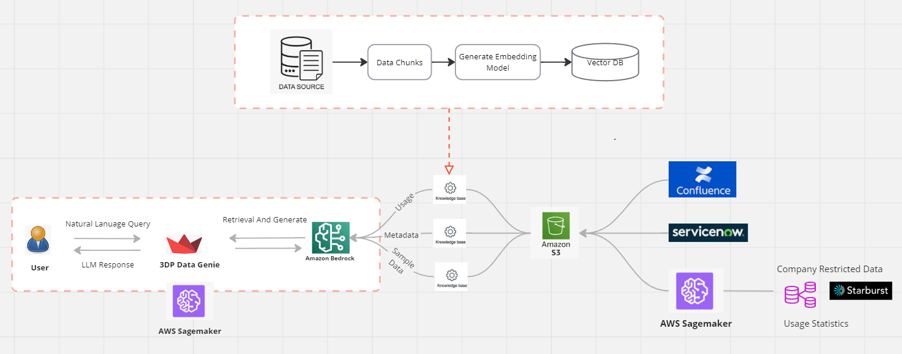

# GenAI ChatBot

This project is a Streamlit-based GenAI ChatBot leveraging Amazon Bedrock and LangChain for retrieving knowledge from predefined knowledge bases.

# Architecture



## Project Structure
```bash
genai_chatbot/
│
├── .vscode/
│ └── settings.json
├── app/
│ ├── init.py
│ ├── config.py
│ ├── logging_setup.py
│ ├── model.py
│ ├── retriever.py
│ ├── s3_utils.py
│ ├── streamlit_ui.py
│ ├── utils.py
│ └── main.py
├── requirements.txt
├── README.md
└── .gitignore
```

## Setup Instructions

1. Clone the repository:
    ```bash
    git clone <repository-url>
    cd genai_chatbot
    ```

2. Create a virtual environment and activate it:
    ```bash
    python3 -m venv venv
    source venv/bin/activate  # On Windows use `venv\Scripts\activate`
    ```

3. Install the dependencies:
    ```bash
    pip install -r requirements.txt
    ```

4. Run the Streamlit app:
    ```bash
    streamlit run app/main.py
    ```

## Usage

- Navigate to the Streamlit app in your web browser.
- Use the sidebar to select the knowledge base and toggle streaming mode.
- Type your question in the chat input and interact with the chatbot.
- View source details and citations by expanding the sections below the chatbot's response.

## Notes

- Ensure you have your AWS credentials configured properly for boto3 to access Amazon Bedrock.
- Modify the configurations in `app/config.py` as needed.
